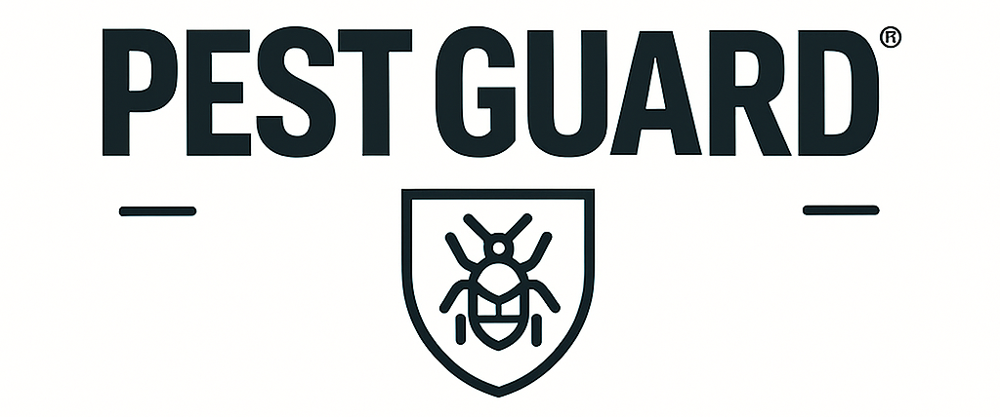

  

# PestGuard: 전자동 무인 해충 구제 올인원 솔루션

  
해충을 위한 나라는 없다.

## 프로젝트 설명

사람이 없는 시간대에 출몰하는 해충을 인식하고 해충의 이동 경로에 로봇이 자동으로 약을 분사하여 해충 방제를 수행합니다.

## 주요 기능

1. 이미지 프로세싱을 통한 해충 감지 및 경로 파악
2. 해충 감지시 해충 이동 경로로 로봇이 이동, 방제 시도
3. 핸드폰 앱과 데스크탑 앱을 통하여 벌레 감지 여부, 방제 시도 기록 등 열람 가능

## 사용 기술들

  

 

  

## 레포지토리

 

 

## 개발자

|황인기|송가람|설유승|신경임|
|:------:|:------:|:------:|:------:|
|  |  |  |  |

